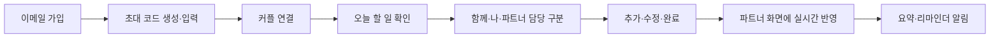
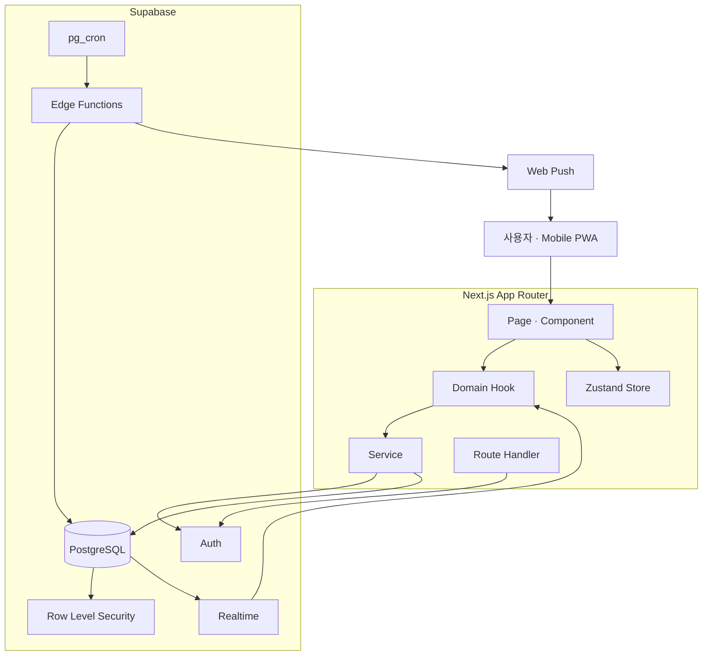
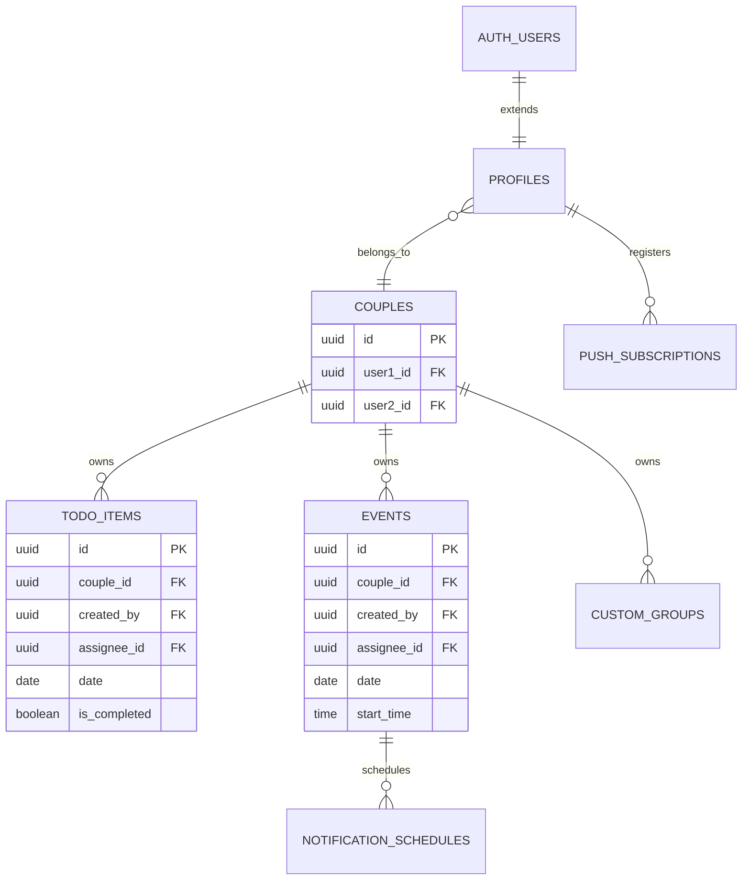
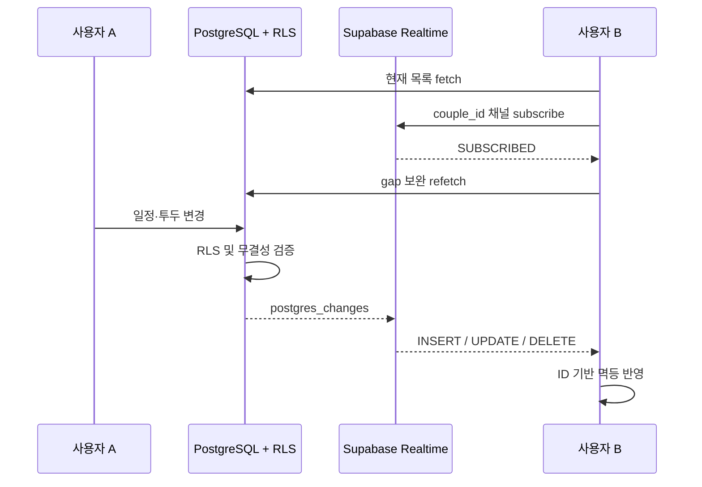
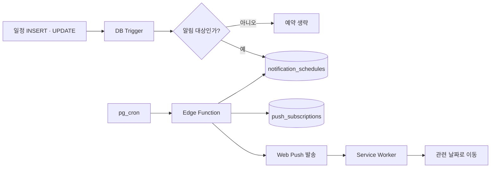

# 하루투두 포트폴리오 다이어그램

포트폴리오 웹과 발표 자료에 공통으로 사용할 다이어그램 원본이다.

## 1. 핵심 사용자 흐름

## 2. 시스템 구성

## 3. 커플 데이터 모델

## 4. Realtime 정합성

## 5. 예약 알림

## 발표 시 강조할 관계

- `couple_id`는 데이터 조회, RLS, Realtime 필터를 관통하는 공유 경계다.
- RLS는 접근 권한을, FK·unique·check·trigger는 유효한 데이터 상태를 보장한다.
- Realtime은 최초 조회를 대체하지 않으며 fetch-subscribe gap을 별도로 보완한다.
- DB는 알림 예약의 정합성을, Edge Function은 외부 네트워크 발송을 담당한다.
